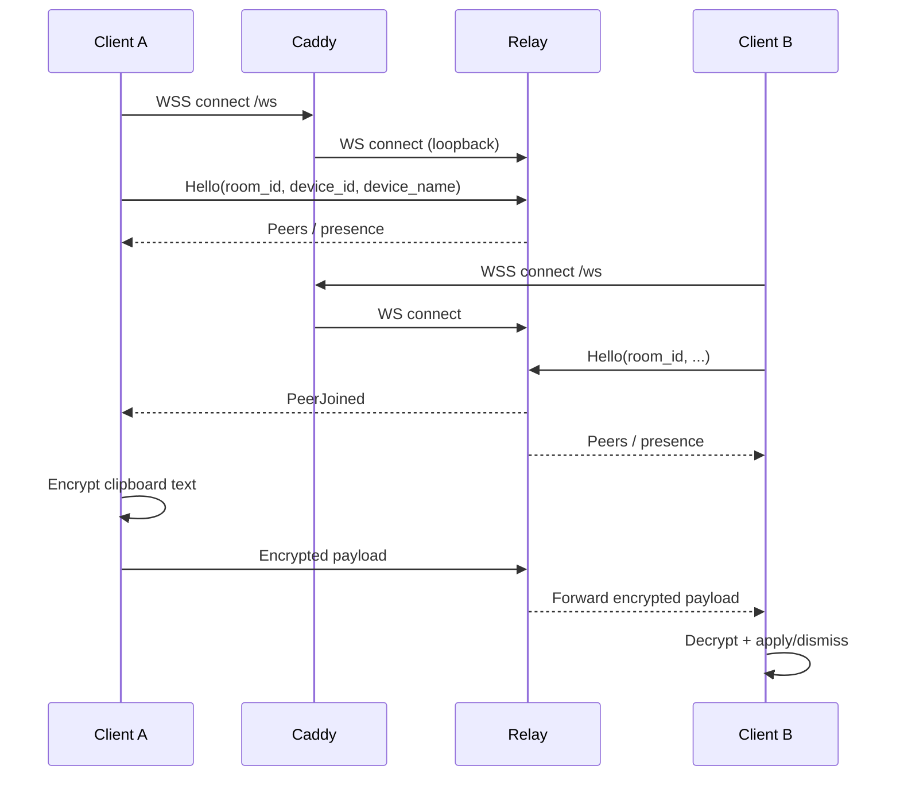

# ClipRelay — How It Works (Architecture + User Guide + Ops)

This document explains how ClipRelay works from both:

- a **user perspective** (what you click, what the tray colors mean)
- an **architecture/ops perspective** (protocol, encryption, relay behavior, and cloud deployment behind Caddy + systemd)

## 1) What ClipRelay Is

ClipRelay synchronizes **clipboard text** between devices that share a **room code**.

- Clients connect **outbound** to a relay using WebSockets (`ws://` for local dev, `wss://` for internet deployment).
- Clipboard text is **encrypted on the client** before it leaves the machine.
- The relay is a lightweight forwarder: it **cannot decrypt** clipboard contents.

## 2) Components (Rust Workspace)

### cliprelay-core (pure core logic)

Responsibilities:

- Wire framing (`encode_frame` / `decode_frame`)
- Room key derivation (HKDF-SHA256)
- Encryption/decryption (XChaCha20-Poly1305)
- Replay protection helpers and size limits

Source: [cliprelay-core/src/lib.rs](../cliprelay-core/src/lib.rs)

### cliprelay-relay (server)

Responsibilities:

- WebSocket endpoint `/ws`
- In-memory room membership tracking
- Forward encrypted payloads to other peers in same room
- Enforce limits and basic rate limiting

Source:

- [cliprelay-relay/src/main.rs](../cliprelay-relay/src/main.rs)
- [cliprelay-relay/src/lib.rs](../cliprelay-relay/src/lib.rs)

### cliprelay-client (Windows tray app)

Responsibilities:

- Native Windows UI (tray-first) via `native-windows-gui`
- Clipboard integration (`arboard`)
- Background runtime (`tokio`) for network + crypto orchestration
- Local config persistence (first-run GUI prompt if no CLI args)

Source: [cliprelay-client/src/main.rs](../cliprelay-client/src/main.rs)

## 3) Rooms, Room Codes, and Why the Relay Doesn’t Need a Room Code

- The **room code** is a human-entered shared secret used by clients.
- Clients derive a **room_id** from the room code and include it in the initial `Hello` control message.
- The relay simply groups clients by the received `room_id`.

So:

- The **relay does not** need a configured room code.
- Two clients must use the **same room code** to end up in the same room.

## 4) Protocol Overview (High Level)

### 4.1 Handshake / Presence

1. Client opens WebSocket connection to the relay.
2. Client sends a **binary** `Hello` control frame (first frame must be a Hello; otherwise the relay rejects).
3. Relay registers the device in the room and shares peer presence (join/leave/peer list).

### 4.2 Room Key Readiness

The **room key** is derived from:

- the room code (input key material)
- a salt derived from the set of device IDs currently in the room

This is why the UI shows:

- **Amber** when you’re connected but the room key is not ready yet (often: you’re alone in the room)
- **Green** when at least one peer exists and the salt exchange completes

### 4.3 Sending Clipboard Text

- Client encrypts clipboard text with the derived room key.
- Client sends an encrypted frame to relay.
- Relay forwards the encrypted payload to other peers in the same room.

### 4.4 Receiving Clipboard Text

- Client decrypts payload locally.
- If Auto-apply is OFF, UI shows a popup with Apply/Dismiss.
- If Auto-apply is ON, clipboard is applied immediately.

## 5) Security Model (What’s Protected)

### 5.1 Encryption

- Algorithm: XChaCha20-Poly1305
- Encryption is performed on clients.

Implication:

- The relay can observe metadata like **which room_id** and **device IDs** are active, and message sizes/timings.
- The relay cannot decrypt clipboard text.

### 5.2 Replay Protection

Each sender has a monotonic counter (per sender). Receivers reject stale/duplicate counters.

## 6) Windows Client UX (Tray-First)

### 6.1 First run / configuration

You can start the client either:

- via CLI (`--server-url`, `--room-code`, `--device-name`), or
- by double-clicking the EXE.

If `--room-code` is omitted and no saved config exists, a **Setup** window prompts for:

- Room code
- Server URL (`ws://` or `wss://`)
- Device name

Saved config path:

- `%LOCALAPPDATA%\ClipRelay\config.json`

Background mode:

- `--background` starts the app in the tray using the saved config.
- If no saved config exists, `--background` exits without showing setup prompts.

### 6.2 Tray status colors

- **Red**: disconnected / cannot reach relay
- **Amber**: connected but room key not ready yet
- **Green**: connected and room key ready

### 6.3 User actions

- Double-click tray icon: open/close Send window
- Right-click tray icon: Options / Quit

Options:

- Auto apply (when enabled, incoming text is applied automatically)
- Start with Windows (adds/removes a per-user startup entry under `HKCU\Software\Microsoft\Windows\CurrentVersion\Run` that launches `"cliprelay-client.exe" --background`; implemented via WinAPI registry calls)

## 7) Sending Mode (Manual Only)

This client is **manual-send only**:

- It does **not** automatically transmit everything you copy.
- To send, open the Send window (double-click the tray icon), paste/type into the textbox, and click **Send**.
- Receiving still shows tray + popup notifications.

### 7.1 Files (MVP)

- The Send window also has **Send file…** to transmit an arbitrary file.
- Files are **chunked** and sent end-to-end encrypted through the relay.
- Max file size is **5 MiB** (hard cap).
- On the receiving machine, the popup shows a preview; click **Save** to write the file under `Downloads\ClipRelay`.

## 8) Relay Behavior (What It Does and Doesn’t Do)

The relay:

- Accepts WebSocket clients at `/ws`
- Tracks membership in memory only
- Forwards encrypted messages to other peers in the same room

The relay does NOT:

- Persist messages or clipboard history
- Provide store-and-forward (offline clients will miss messages)
- Decrypt clipboard contents

## 9) Cloud Deployment on relay.swatto.co.uk

### 8.1 Process layout

- `cliprelay-relay` listens only on **loopback** `127.0.0.1:8080`.
- **Caddy** terminates TLS on `:443` for `relay.swatto.co.uk` and reverse-proxies WebSocket traffic.

### 8.2 Caddy (TLS termination + routing)

Active shape (from `/etc/caddy/Caddyfile` on the VM at time of writing):

- `relay.swatto.co.uk/healthz` returns plain `ok` (served by Caddy)
- `relay.swatto.co.uk/ws*` is reverse-proxied to `127.0.0.1:8080`

Notes:

- Caddy automatically obtains and renews TLS certificates (ACME).
- WebSockets work through `reverse_proxy` automatically (including Upgrade).

### 8.3 systemd auto-start (relay)

The relay runs as a systemd service:

- unit: `cliprelay-relay.service`
- enabled on boot: `systemctl is-enabled cliprelay-relay.service` should be `enabled`

Repo deployment helpers:

- [deploy/cliprelay-relay.service](../deploy/cliprelay-relay.service)
- [deploy/install-relay-systemd.sh](../deploy/install-relay-systemd.sh)

### 8.4 Ports

- Public:
  - TCP 80 (Caddy for ACME + redirects)
  - TCP 443 (Caddy TLS + WebSocket proxy)
- Private/local:
  - TCP 8080 (relay loopback)

## 10) Operational Troubleshooting

### 9.1 “Client shows nothing / exits”

- If you double-click the EXE with no args:
  - you should see the Setup window (first run) or it should use the saved config.
- Logs:
  - `%LOCALAPPDATA%\ClipRelay\logs\cliprelay-client.log`

### 9.2 Tray stays Amber forever

Common reasons:

- Only one device is connected to that room
- Room key derivation is waiting for peer set/salt exchange

### 9.3 Public HTTPS health differs from local relay health

- Public: `https://relay.swatto.co.uk/healthz` returns `ok` (Caddy response)
- Local relay: `http://127.0.0.1:8080/healthz` returns JSON like `{"ok": true}`

Both are useful:

- If public is down: Caddy/DNS/firewall problem.
- If local is down: relay process/service problem.

## 11) Diagrams

### 10.1 High-level component diagram

```mermaid
graph TD
  ClientA[cliprelay-client (Windows)] -->|wss://.../ws| Caddy[Caddy TLS + reverse_proxy]
  ClientB[cliprelay-client (Windows)] -->|wss://.../ws| Caddy
  Caddy -->|ws://127.0.0.1:8080/ws| Relay[cliprelay-relay]
  ClientA --> Core[cliprelay-core]
  ClientB --> Core
  Relay --> Core
```

### 10.2 Message flow (simplified)


